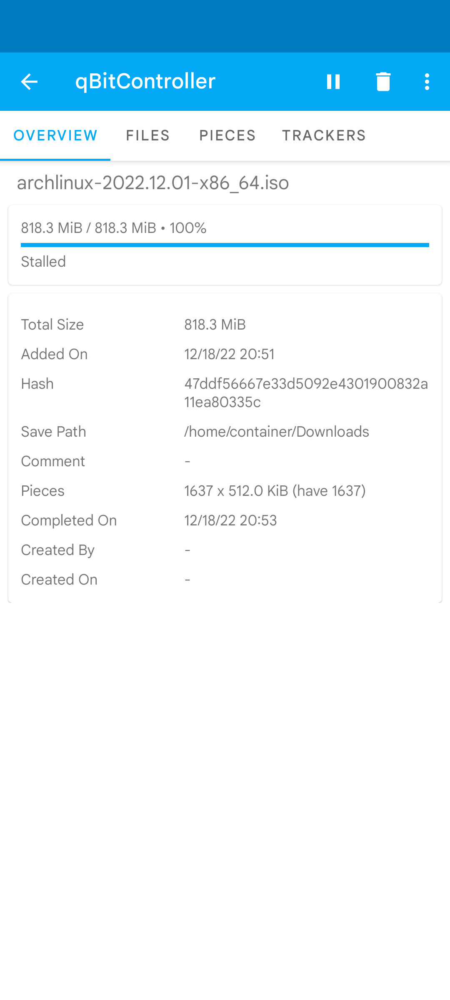
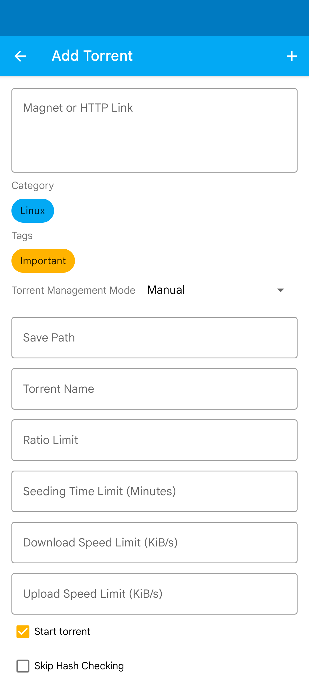
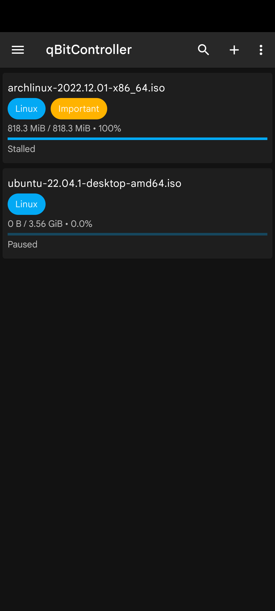

# qBitController
fork from https://github.com/Bartuzen/qBitController

qBitController is a free and open-source app that allows you to control [qBittorrent](https://github.com/qbittorrent/qBittorrent) from Android, iOS, Windows, Linux, and macOS devices.

## Screenshots

[Prowlarr](https://prowlarr.com) is an indexer manager/proxy built on the popular arr .net/reactjs base stack to integrate with your various PVR apps. Prowlarr supports management of both Torrent Trackers and Usenet Indexers. It integrates seamlessly with LazyLibrarian, Lidarr, Mylar3, Radarr, and Sonarr offering complete management of your indexers with no per app Indexer setup required (we do it all).

qBitController-pr allows you to search for BT/PT site resources using Prowler within the same app and pass them to the qBittorrent downloader, monitoring the download progress in real time. It supports configuring different qBittorrent downloaders/download paths for different categories.You need to configure the qBittorrent server and Prowlarr server information in your app, and then you can start using it.
