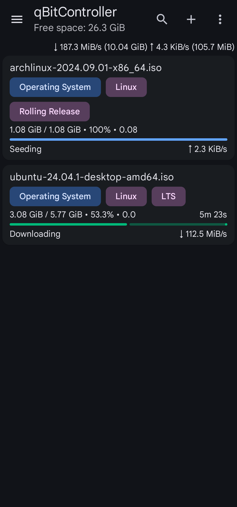

# qBitController
fork from https://github.com/Bartuzen/qBitController

qBitController is a free and open-source app that allows you to control [qBittorrent](https://github.com/qbittorrent/qBittorrent) from Android, iOS, Windows, Linux, and macOS devices.

## Screenshots

## Translations

Check out [Weblate](https://hosted.weblate.org/engage/qbitcontroller) for contributing to localization.
